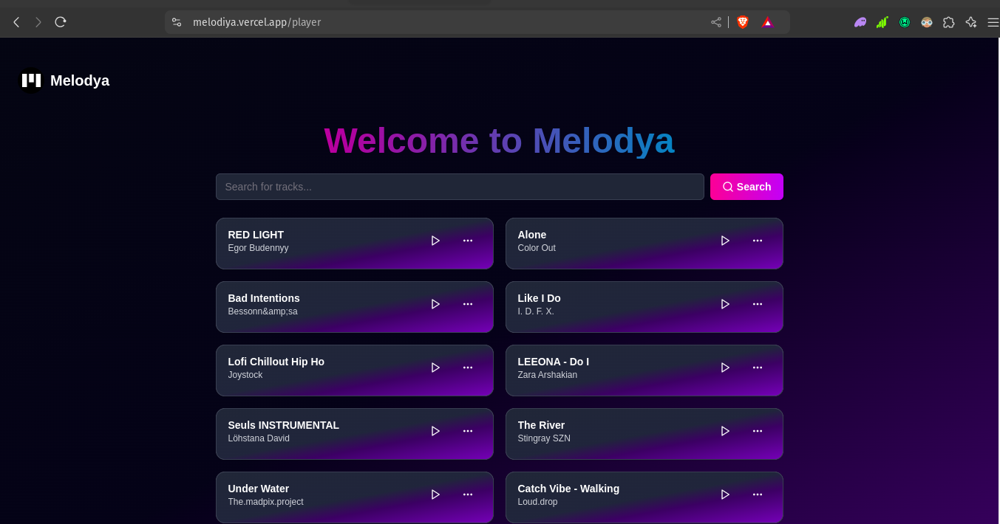

# Melodya

## Introduction

Melodya is a modern music application that offers a seamless music listening experience. Built with **Next.js**, **TypeScript**, and **Tailwind CSS**, it integrates with the Jamenco Music API to provide dynamic music playback. The app features a Landing Page, a Get Started Page, and a Player Page.

- **Deployed Site**: [Melodya Live](https://melodiya.vercel.app)
- **Author(s) LinkedIn**: [Ebubechi Anyanwu](https://www.linkedin.com/in/chiefebube)

## Screenshot



## Installation

To set up Melodya locally, follow these steps:

1. **Clone the repository:**

   ```bash
   git clone https://github.com/your-username/melodya.git
   ```

2. **Navigate to the project directory:**

   ```bash
   cd melodya
   ```

3. **Install dependencies:**

   ```bash
   npm install
   ```

4. **Set up environment variables:**

   Create a `.env.local` file in the root directory and add your Jamenco Client ID:

   ```env
   JAMENCO_CLIENT_ID=your_api_key_here
   ```

5. **Run the development server:**

   ```bash
   npm run dev
   ```

6. **Open your browser and go to:**

   ```
   http://localhost:3000
   ```

## Usage

Once the application is running, you can:

- **Explore the Landing Page**: Get an overview of Melodya and navigate to the Get Started page.
- **Get Started**: Follow the instructions to begin using the app.
- **Use the Player Page**: Interact with the music player to play, pause, and control playback of tracks fetched from the Jamenco Music API.

## Contributing

Contributions are welcome! To contribute to Melodya:

1. **Fork the repository** on GitHub.
2. **Create a new branch** for your changes:

   ```bash
   git checkout -b feature/your-feature
   ```

3. **Make your changes** and commit them:

   ```bash
   git commit -am 'Add new feature'
   ```

4. **Push to the branch**:

   ```bash
   git push origin feature/your-feature
   ```

5. **Create a pull request** with a clear description of your changes.

## Related Projects

- [Next.js Documentation](https://nextjs.org/docs)
- [TypeScript Documentation](https://www.typescriptlang.org/docs/)
- [Tailwind CSS Documentation](https://tailwindcss.com/docs)
- [Jamenco Music API](https://jamenco-api-url.com)

## Licensing

This project is licensed under the **MIT License** - see the [LICENSE](LICENSE) file for details.